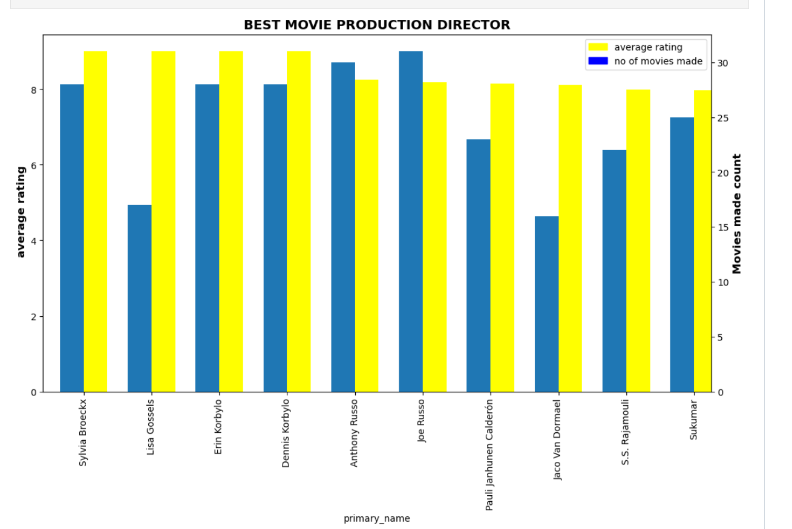

# Movie Earnings Analysis
### Author: Nelson Kibet Kemboi
## Overview  

This report analyzes available movie data to identify several aspects of Microsoft should consider before investing. The data used for this analysis includes information about movie earnings and other aspects of those films. By analyzing this information, several actionable insights for producing successful movies are revealed.
## Business Problem
Since not all movies are created equally, there are several factors that need to be considred before investing in the movie industry by Microsoft. These factors are important as they influnce the profitability and popularity of movies. In this report I will identify several factors that affect profitability like genre, studio and directors.
## Data
I will be using data from three files that is:
* im.db
* tn.movie_budgets.csv.gz
* tmdb.movies.csv.gz
## Methods 
In this report i read the data from SQL table and csv datasets. Since some had null values and duplicated I cleaned data so that it can be easier for analysis.  I used the analysis to garner information to aid in my decision making
## Results
 ### Genre classification based on votes
 
 It can be seen that people voted much for some genre. 
Over 600,000 votes were tabulated like Action/Thriller and Drama/Western.
### Best directors in the industry 

Best movie directors rankings.
This is based on the number of movies made and the average ratings they had. 
### Best studios

Top ten studies by gross domestic sorting. 
Ratings is based on gross domestic returns.
### Return on Investment 
 
Movies return on investments verses production budget chart. 
No linear correlaton between production budget and ROI
## Conclusion
### Top studios by earnings
This are studios with higher average income hence considered as best for microsoft company to use them in production 
* BV
* P/DW
* WB(NL)
* Uni.
* WB
### Most preferred directors
This are directors that most of had higher ratings and produced alot of movies 
* Sylvia Broeckx
* Dennis Korbylo
* Erin Korbylo
* Joe Russo 
### Most preferred collection of Genres
This are best colection of genres people voted as thier most preference 
* Action/thriller 
* Drama/Western
* Biography/Drama/Crime
* Mystery/Thriller 
Further analysis should be done to determine more factors between movie production cost and returns to get more insights 
## For More Information
Please review the full analysis in the Jupyter Notebook or the presentation.

For any additional questions, please contact Nelson Kemboi

